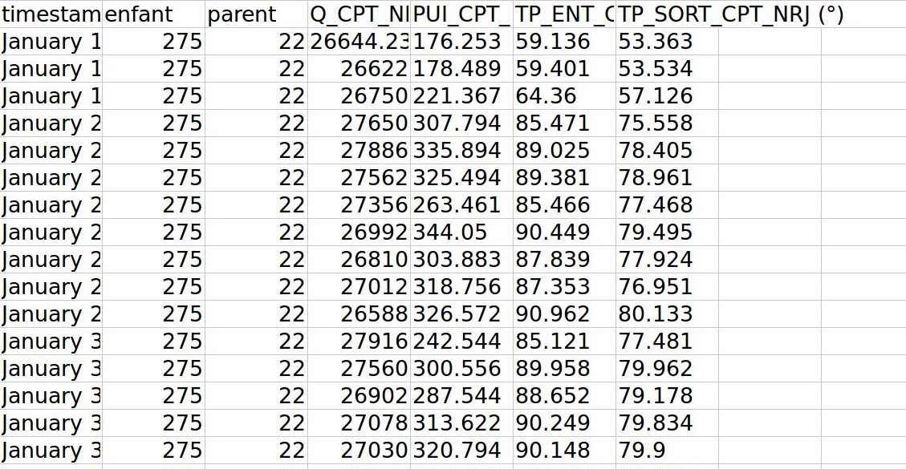
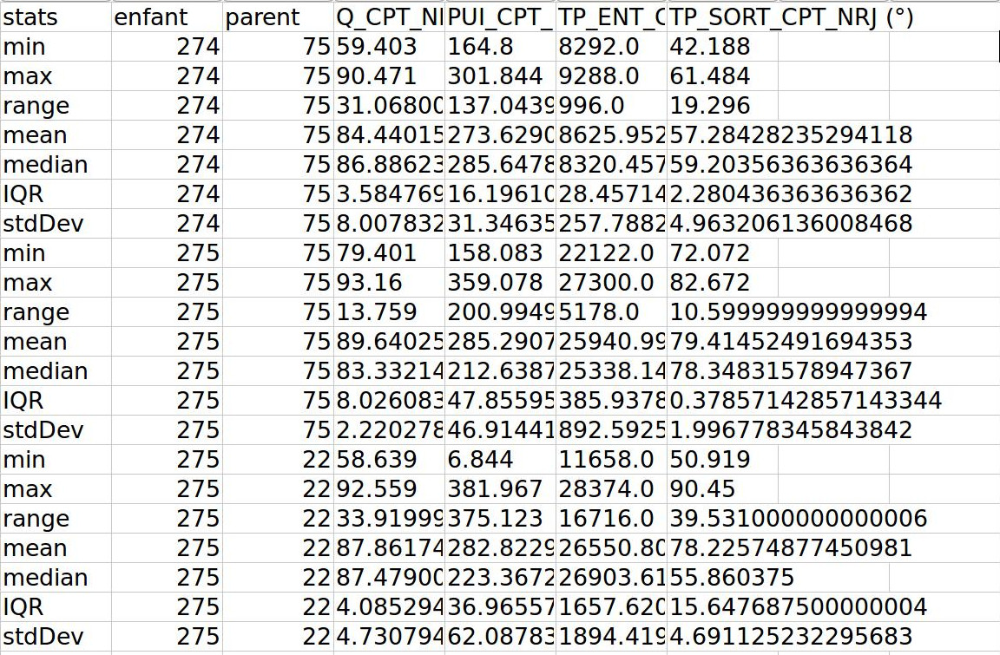

**********************
demoAPI.py
**********************

Description
============

Principe:
	Pour chaque arc (i.e. chaque couple (enfant, parent) distinct), et pour chaque colonne contenue dans le fichier, nous écrivons en sortie, un compte-rendu statistique des mesures relevées.

Appel en ligne de commande :

.. code-block:: console

	python demoAPI.py monFichier.csv maSortie.csv
	
Le fichier ``monFichier.csv`` est au même format que ceux qui peuvent être analyser par l'interface web.

Quant au fichier ``maSortie.csv`` son format est similaire, voici ses colonnes :
	* stats : information statistique calculée pour la ligne
	* enfant : numéro du noeud
	* parent : numéro du noeud
	* mesures : information de la colonne \ *stats*\  calculée pour toutes les données la colonne mesure de ``monFichier.csv`` à l'arc correspondant.

Les colonnes mesures correspondent aux données mesurées sur le réseau. Un exemple sera plus parlant.

L'image ci-dessous sert d'example pour ``monFichier.csv``, on reconnaît les timestamps, et pour l'arc (275, 22), les mesures des quatre colonnes, sont faites à desinstants différents.

	
Enfin, l'image ci-dessous sert d'example pour ``maSortie.csv``. On peut toujours voir l'arc (275, 22). Cependant pour les quatre colonnes, il ne s'agit de mesures, mais de calculs dont les descriptions figurent dans la colonne \ *stats*\.
	

Fonctions réutilisées
=====================

Les résultats satisfaisants de ce script nous ont inscités à réutiliser ses fonctionnalités au sein même de notre application:
	* ``safe_open_w`` : garantit la création des dossiers après eventuels clean up.
	* ``ecrireResultats`` : pour le téléchargement des résultats d'analyse descriptive.

.. automodule:: demoAPI

.. autofunction:: safe_open_w

.. autofunction:: ecrireResultats
